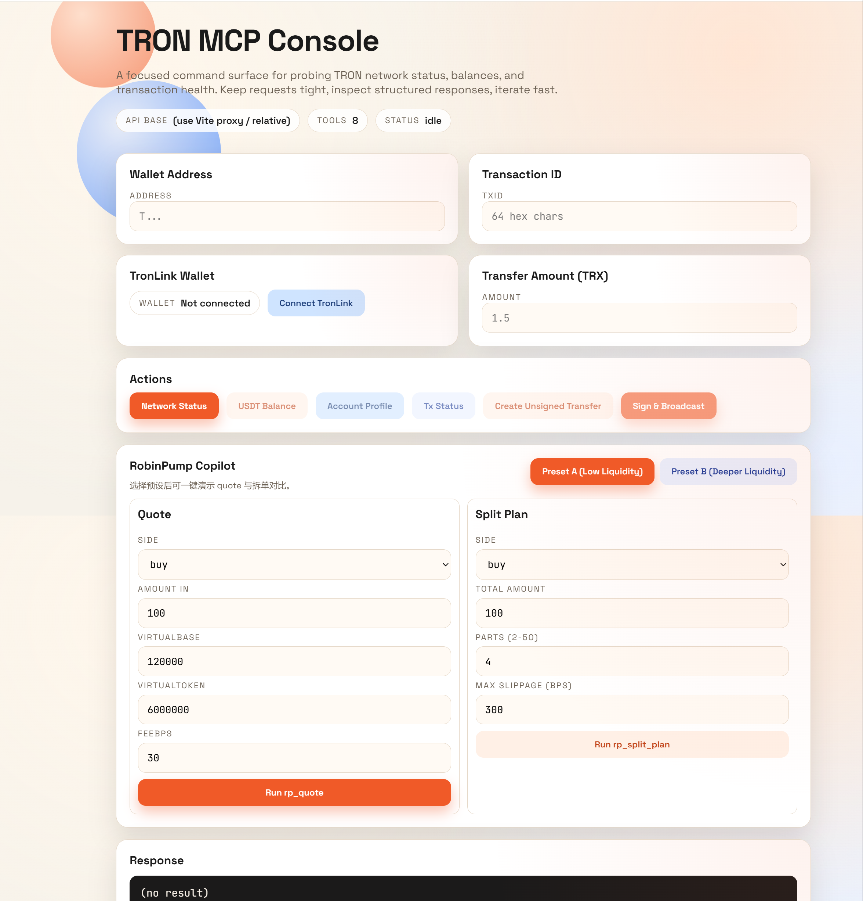
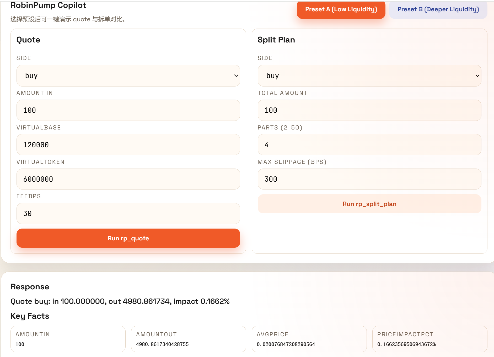
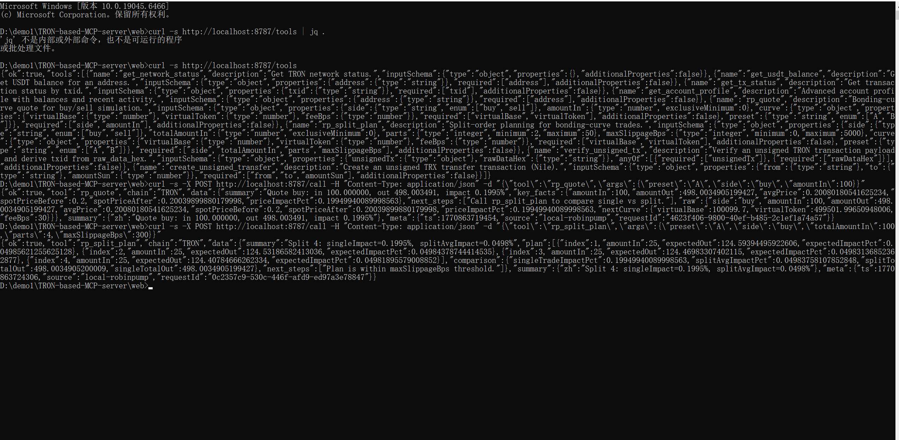

# 🚀 RobinPump Copilot（TRON MCP + Web Console）

> 面向 RobinPump.fun 的交易前辅助系统：提供报价预演、滑点评估与拆单计划，帮助用户更高效完成交易决策。

## 🧠 项目背景

在 bonding curve 交易场景中，常见问题包括：

- 单笔下单金额较大时，价格冲击明显
- 缺少下单前的可视化预演
- 无法快速判断“单笔执行”还是“拆单执行”更优

## 🛠 解决方案

本项目在 TRON MCP Server 基础上扩展了 RobinPump Copilot 能力：

- `rp_quote`：交易前报价与价格冲击预演
- `rp_split_plan`：拆单执行计划与单笔对比
- 同时保留 TRON 核心工具（网络、余额、交易状态、账户画像、未签名交易）

## ⚙️ 技术栈

- Node.js（ESM）
- `@modelcontextprotocol/sdk`
- TronGrid API / TronScan API
- React + Vite
- TronLink（前端签名与广播）

## 🔗 与 TRON 链的交互流程

1. 客户端调用 `/tools` 获取工具目录。
2. 通过 `/call` 调用 `rp_quote`、`rp_split_plan` 等工具。
3. 服务端向 TronGrid / TronScan 请求链上数据并返回结构化结果。
4. 交易闭环场景中，服务端生成 unsigned tx，前端用 TronLink 完成签名与广播。

## 🧩 工具清单

### RobinPump Copilot

- `rp_quote`
- `rp_split_plan`

### TRON 核心工具

- `get_network_status`
- `get_usdt_balance`
- `get_tx_status`
- `get_account_profile`
- `verify_unsigned_tx`
- `create_unsigned_transfer`

## ⚡ 评委快速验证（Judge Quickstart）

先启动后端：

```powershell
cd server
npm install
npm run dev
```

执行 3 条命令：

```bash
curl -s http://localhost:8787/tools | jq .
curl -X POST http://localhost:8787/call -H "Content-Type: application/json" -d '{"tool":"rp_quote","args":{"preset":"A","side":"buy","amountIn":100}}' | jq .
curl -X POST http://localhost:8787/call -H "Content-Type: application/json" -d '{"tool":"rp_split_plan","args":{"preset":"A","side":"buy","totalAmountIn":100,"parts":4,"maxSlippageBps":300}}' | jq .
```

预期结果：

- 工具列表包含 `rp_quote` 与 `rp_split_plan`
- `singleTradeImpactPct > splitAvgImpactPct`
- `summary` 给出明确拆单建议

## 🎬 提交素材入口

- Canva Slides：`https://www.canva.com/design/TODO_REPLACE`
- Demo 视频：`demo/videos/demo-video.mp4`
- Loom 讲解视频：`demo/videos/loom-walkthrough.mp4`

### UI 截图路径

- `demo/screenshots/web-console-main.png`
- `demo/screenshots/mcp-call-result.png`
- `demo/screenshots/terminal-curl.png`





## 📁 项目结构

```text
.
├─ README.md
├─ LICENSE
├─ server/
├─ web/
├─ docs/
└─ demo/
   ├─ screenshots/
   └─ videos/
```
